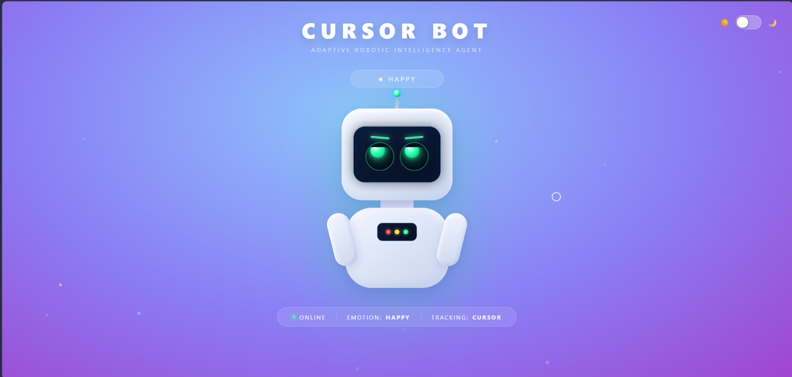

# 🤖 Cursor Bot — Interactive Emotion Robot

A fully interactive, single-page robot website built with pure HTML, CSS, and JavaScript. No frameworks, no libraries, no installation required — just open in a browser.



---

## 🌐 Live Demo

Open `index.html` in any modern browser to run it instantly.

---

## ✨ Features

### 👀 Cursor-Tracking Eyes
- Both eyes independently follow your cursor in real time
- Pupils move up to 8px from center using angle + distance math
- Smooth `ease-out` transitions for natural-feeling movement
- Eyes slow down gracefully when the cursor is far away

### 😄 8 Facial Emotions
The robot reacts to how you interact with it. Each emotion changes the **eyebrows**, **eyelids**, **pupil size**, **pupil color/glow**, and **antenna ball color**.

| Emotion | Trigger | Visual Changes |
|---------|---------|----------------|
| **Neutral** | Slow/no movement | Level brows, normal blue eyes |
| **Curious** | Medium cursor speed | Left brow raised, right eye slightly squinted |
| **Excited** | Fast cursor movement | Brows raised high, wide yellow pupils, arms spread, faster float |
| **Surprised** | First click | Brows shoot up, pupils shrink to tiny dots (purple) |
| **Happy** | After clicking / mouse enters page | Squinting eyes, brows tilt up, green glow |
| **Angry** | 4–6 rapid clicks | Brows slash inward (\ /), heavy squint, red pupils |
| **Sad** | Cursor idle for 5 seconds or leaves page | Brows curve inward (∧), droopy lower lids, teardrops fall |
| **Sleepy** | Cursor idle for 10+ seconds | Eyes half-closed, brows droop, pupils drift slowly |

### 💥 Rage Sequence (7 Rapid Clicks)
Click 7 times rapidly to trigger a full rage animation:
1. **Violent shake** — robot vibrates left and right with a red glow
2. **Punch** — both arms swing up like a haymaker, robot lunges forward
3. **Screen flash** — white impact flash fires across the screen
4. **Screen crack** — white crack lines radiate from the impact point across the entire screen
5. **Storm off** — robot rotates and slides off-screen to the right in anger
6. **Crack fades** — the cracks dissolve while the robot is gone
7. **Sneaks back** — robot quietly slides back in from the left and returns to neutral

### 🌙 Dark / Light Theme Toggle
- Toggle switch in the top-right corner (☀️ / 🌙)
- Smooth 0.55s transition on all elements
- Dark theme turns the robot from white to dark charcoal
- Background shifts to a deep space navy/purple gradient
- All emotion glow effects adapt to dark mode

### 🎨 Visual Details
- Pure CSS robot — no images used
- Floating animation (bobs up and down continuously)
- Pulsing antenna ball that changes color with emotion
- CRT scanline effect on the robot's face panel
- Eyebrow rotation system (8 directions per emotion)
- Upper and lower eyelids for squinting and drooping
- Smooth blinking every 2.5–6 seconds
- Teardrops that fall from the eyes when sad
- Floating background particles
- Custom cursor (circle that shrinks on click)
- Click ripple effect
- Status bar showing current emotion and live status

---

## 🗂️ Project Structure

```
cursor-bot-website/
│
└── index.html       # Entire project — HTML + CSS + JS in one file
```

---

## 🚀 How to Run

1. Download or clone this repository
2. Double-click `index.html`
3. It opens in your browser — done

No server, no Python, no Node.js, no dependencies.

---

## 🛠️ How It Works

### Eye Tracking
```
angle  = atan2(cursorY - eyeCenterY, cursorX - eyeCenterX)
travel = min(distance / 85, 1) × MAX_TRAVEL
offsetX = cos(angle) × travel
offsetY = sin(angle) × travel
```
Each pupil is absolutely positioned inside an `overflow: hidden` circular socket, so it can never escape the eye boundary.

### Emotion System
Emotions are defined as config objects with values for:
- Eyebrow rotation (`rotate(Xdeg)`) and Y offset
- Upper lid coverage % (slides down from top)
- Lower lid coverage % (slides up from bottom)
- Pupil width, height, gradient, and glow
- Antenna ball color

The emotion state machine transitions based on:
- Cursor speed (sampled every `mousemove`)
- Click count (within a 2.2s window)
- Cursor idle time (5s → sad, 10s → sleepy)
- Mouse leaving/entering the page

### Eyebrow Directions
- `rotate(+Xdeg)` → left end UP, right/inner end DOWN
- `rotate(-Xdeg)` → left end DOWN, right/inner end UP
- Sad: inner corners UP (worried ∧ shape) → `browL: -14°, browR: +14°`
- Angry: inner corners DOWN (fierce \/ shape) → `browL: +28°, browR: -28°`

---

## 🎮 Interaction Guide

| Action | Robot Reaction |
|--------|---------------|
| Move cursor slowly | Neutral |
| Move cursor at medium speed | Curious |
| Move cursor fast | Excited |
| Click once | Surprised → Happy |
| Click 4–6 times rapidly | Angry |
| Click 7 times rapidly | RAGE (punch + crack + exit) |
| Leave cursor idle 5s | Sad (with tears) |
| Leave cursor idle 10s | Sleepy |
| Move cursor off screen | Sad |
| Move cursor back onto screen | Happy |
| Toggle top-right switch | Light ↔ Dark theme |

---

## 🧰 Built With

- **HTML5** — structure
- **CSS3** — robot design, animations, transitions, dark theme
- **Vanilla JavaScript** — eye tracking, emotion logic, rage sequence

No external libraries or frameworks.

---

## 👤 Author

**Nanthiesh** — designed and built from scratch.
